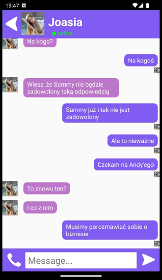
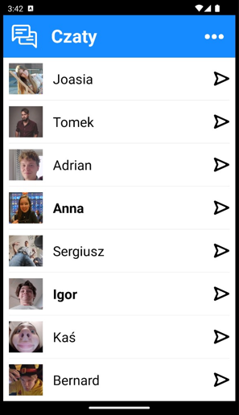
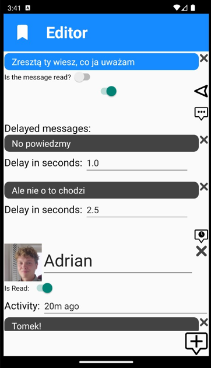
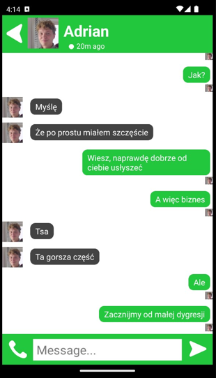
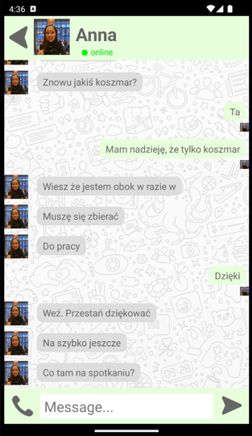
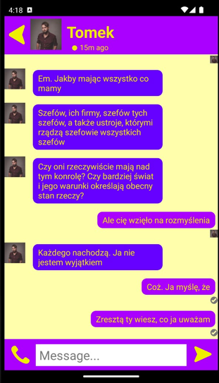
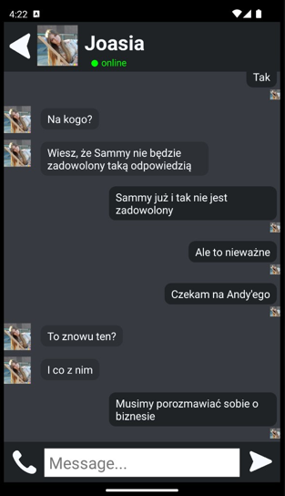
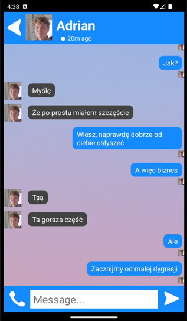
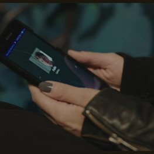

<a name="readme-top"></a>

[![Contributors][contributors-shield]][contributors-url]
[![Forks][forks-shield]][forks-url]
[![Stargazers][stars-shield]][stars-url]
[![Issues][issues-shield]][issues-url]
[![MIT License][license-shield]][license-url]

<!-- PROJECT LOGO -->
<br />
<div align="center">
  <a href="https://github.com/Piqulsky/FakeChat">
    
  </a>

  <h3 align="center">FakeChat</h3>

  <p align="center">
    Programmable pseudo chat application to use without concern about rights
    <br />
    <a href="https://github.com/Piqulsky/FakeChat"><strong>Explore the docs »</strong></a>
    <br />
    <br />
    <a href="https://github.com/Piqulsky/FakeChat">View Demo</a>
    ·
    <a href="https://github.com/Piqulsky/FakeChat/issues">Report Bug</a>
    ·
    <a href="https://github.com/Piqulsky/FakeChat/issues">Request Feature</a>
  </p>
</div>

<!-- TABLE OF CONTENTS -->
<details>
  <summary>Table of Contents</summary>
  <ol>
    <li>
      <a href="#about-the-project">About The Project</a>
      <ul>
        <li><a href="#built-with">Built With</a></li>
      </ul>
    </li>
    <li>
      <a href="#getting-started">Getting Started</a>
      <ul>
        <li><a href="#prerequisites">Prerequisites</a></li>
        <li><a href="#installation">Installation</a></li>
      </ul>
    </li>
    <li><a href="#usage">Usage</a></li>
    <li><a href="#roadmap">Roadmap</a></li>
    <li><a href="#contributing">Contributing</a></li>
    <li><a href="#license">License</a></li>
    <li><a href="#contact">Contact</a></li>
    <li><a href="#acknowledgments">Acknowledgments</a></li>
  </ol>
</details>

<!-- ABOUT THE PROJECT -->
## About The Project

**FakeChat** is an open-source Android mobile application designed to provide a programmable pseudo-chat experience. The primary function of FakeChat is to simulate a typical mobile messaging application, making it an invaluable tool for filmmakers, content creators, and digital storytellers who need a realistic chat interface in their work.

The application allows users to create and customize chat conversations, giving them full control over the content and appearance of the messages. This feature is particularly useful for producing movies, videos, or other content where a realistic-looking chat exchange is needed without the hassle of dealing with licensing or rights issues.

**Key Features:**
- **Imitation of Real Chat Interfaces:** FakeChat closely resembles popular mobile communicators, offering a variety of customization options to mimic real-life messaging apps.
- **Programmable Chats:** Users can pre-program artificial conversations, creating detailed and specific chat sequences. This feature allows complete scripting of dialogues, ensuring that the desired narrative is followed precisely.
- **Delayed Messages:** FakeChat supports the addition of delayed messages, enabling the simulation of real-time conversations. This functionality is perfect for scenarios where timing is crucial, allowing for a more authentic portrayal of interactions.
- **Visual Customization:** The app offers extensive customization options, giving users full control over visual aspects. Users can change color motifs, modify avatars, and even use custom photos for chat backgrounds. These options help in creating a distinct and personalized chat environment that fits the context of the project.
- **Open Source and Free to Use:** As an open-source project, FakeChat is freely available to all. Users can modify and adapt the software to fit their specific needs, promoting creativity and innovation without financial barriers.

Whether you're an amateur filmmaker, a YouTube content creator, or a beginner looking to experiment with pseudo-chat interfaces, FakeChat provides a versatile and practical solution for your creative projects. Its open-source nature encourages collaboration and continuous improvement, making it a community-driven tool for digital creators everywhere.

Feel free to explore the code, contribute, and customize the application to suit your unique requirements. With FakeChat, bring your creative visions to life with ease and without restrictions.

If you enjoy the project, you can support me here - [buy me a tea :D](https://ko-fi.com/piqulsky)

<p align="right">(<a href="#readme-top">back to top</a>)</p>

### Built With


<p align="right">(<a href="#readme-top">back to top</a>)</p>

## Installation

To install FakeChat on your Android device, follow these steps to download the `.apk` file from the GitHub project page:

1. **Visit the GitHub Releases Page**
   - Go to the [FakeChat GitHub repository](https://github.com/Piqulsky/FakeChat).
   - Navigate to the "Releases" section, which can be found under the repository name or by clicking [here](https://github.com/Piqulsky/FakeChat/releases).

2. **Download the Latest Release**
   - On the Releases page, find the latest release of FakeChat.
   - Under the "Assets" section, locate the `.apk` file (e.g., `Chat.apk`).
   - Click on the `.apk` file to start the download.

3. **Enable Installation from Unknown Sources**
   - Before installing the downloaded `.apk` file, you need to enable installation from unknown sources on your Android device.
   - Go to `Settings` > `Security` (or `Privacy` on some devices) > and toggle on `Install unknown apps` or `Unknown sources`.
   - Depending on your device and Android version, this setting might be located under a different menu. Please check your device's documentation if needed.

4. **Install the Application**
   - Once the download is complete, open the downloaded `.apk` file.
   - You may receive a prompt asking for permission to install the app. Confirm and proceed with the installation.

5. **Launch FakeChat**
   - After the installation is complete, you can open FakeChat from your app drawer.
   - You are now ready to start creating programmable pseudo-chats!

**Note:** Always ensure you download `.apk` files from trusted sources. The FakeChat GitHub repository is the official source for downloading the latest and most secure version of the application. However if you get a warning when installing FakeChat, I am sincerely sorry for that, since I have not found time to ensure that the app is treated by Android as a safe app.

<p align="right">(<a href="#readme-top">back to top</a>)</p>

<!-- GETTING STARTED -->
## Getting Started

To get a local copy of the FakeChat project up and running on your machine, follow these steps.

### Prerequisites

Before you begin, ensure you have the following software installed on your development machine:

1. **Java Development Kit (JDK)**
   - FakeChat is developed in Java, so you need to have the JDK installed. Download and install the latest version of JDK from [Oracle's official site](https://www.oracle.com/java/technologies/javase-jdk11-downloads.html) or use a version management tool like SDKMAN to manage different JDK versions.

2. **Android Studio**
   - Android Studio is the official Integrated Development Environment (IDE) for Android development. You can download it from [the official Android Developer website](https://developer.android.com/studio).

3. **Git**
   - Git is a version control system required for cloning the project repository. You can download Git from [the official Git website](https://git-scm.com/downloads).

### Process

1. **Clone the Repository**
   - First, clone the FakeChat repository from GitHub to your local machine. Open a terminal and run the following command:
     ```sh
     git clone https://github.com/Piqulsky/FakeChat.git
     ```
   - This will create a directory named `FakeChat` with all the project files.

2. **Open the Project in Android Studio**
   - Launch Android Studio.
   - Select "Open an existing Android Studio project" from the welcome screen or go to `File` > `Open` if you're already inside Android Studio.
   - Navigate to the cloned `FakeChat` directory and select it. Android Studio will begin to import the project.

3. **Sync the Project with Gradle**
   - Once the project is opened, Android Studio will automatically sync it with Gradle. If it doesn't start automatically, go to `File` > `Sync Project with Gradle Files`.
   - This process downloads all the necessary dependencies specified in the `build.gradle` files.

4. **Set Up an Android Virtual Device (AVD)**
   - If you don't have a physical device to test the application, set up an Android Virtual Device (AVD) by going to `Tools` > `AVD Manager` and following the prompts to create a new virtual device.

5. **Run the Application**
   - To run the FakeChat application, click the green "Run" button (or press `Shift + F10`). Select the device you want to run the app on (either a connected physical device or an AVD).
   - Android Studio will build the project and launch the application on the selected device.

Now you're ready to explore the codebase, make modifications, and contribute to the FakeChat project.

<p align="right">(<a href="#readme-top">back to top</a>)</p>


<!-- USAGE EXAMPLES -->
## Usage

### Chatting



**Chat view** in FakeChat allows users to simulate a realistic chat environment with various customizable options. Below are the key functionalities available in the Chatting interface:

- **Avatar Customization:**
  - The avatar of the person you are messaging can be customized. To change the avatar, tap on the current avatar icon. This action will open the photo gallery, where you can select a new image to represent the contact. This feature helps in tailoring the chat interface to match your project's requirements.

- **Activity Status:**
  - Below the avatar, the current activity status of the person is displayed. This status indicates whether the person is "online" or not. If the person is online, the status will appear in green; if not, it will be gray. This visual cue helps in simulating the dynamic nature of real-time chat applications.

- **Message History:**
  - Users can scroll through earlier messages in the chat to review the conversation history. This feature is useful for creating a sense of continuity and context in the simulated chat.

- **Writing New Messages:**
  - To write a new message, use the text input field at the bottom of the chat view. Once you enter your message, you can simulate sending it. Each message sent can be customized with a status indicator below it, showing whether the message has been read or not, adding an extra layer of realism.

- **Call Functionality:**
  - In the lower left corner of the chat view, there is a call button. Tapping this button switches the interface to a fake call view, simulating a call with the contact. This feature is ideal for scenarios where a voice conversation is needed in the narrative.

- **Exiting Call View:**
  - To leave the fake call view, press the red disconnect button. This action ends the call simulation and returns you to the chat interface.

- **Exiting Chat View:**
  - To exit the chat view and return to the main interface or previous screen, press the button in the upper left corner. This button acts as a back navigation control, allowing you to leave the chat session.

These features provide a comprehensive and customizable experience, enabling users to create realistic chat scenarios for their projects. Whether you're simulating a conversation or a call, FakeChat offers a versatile platform to enhance your creative work.

### Chats



**Other chats view** in FakeChat allows users to manage multiple chat conversations, each customizable with unique attributes. Here's an overview of the functionalities available in this section:

- **Chats Name:**
  - This view is labeled with a name, which can represent the app name or a group, similar to naming conventions in real chat applications.

- **Navigating Between Chats:**
  - Users can switch between different chat conversations using the arrow buttons located on the right side of each chat entry. This navigation method provides an intuitive way to explore various chats, whether they're individual or group conversations.

- **Read Status Indicators:**
  - The name of each chat serves as a visual indicator of whether the chat has been read. If the chat has unread messages, the name appears in bold text, signaling that there are new, unseen messages. If all messages have been read, the text will appear in regular font weight. This feature mimics the notification style of real messaging apps, enhancing the authenticity of the simulation.

- **Editing Conversations and Visual Aspects:**
  - To edit conversations and customize visual elements, users can press the button located in the upper right corner of the screen. This action takes the user into an editor mode, where they can:
    - Modify the content of any chat conversation, including adding, deleting, or altering messages.
    - Change the visual aspects of the chat interface, such as chat names, avatars, and other aesthetic elements, allowing for a fully tailored chat experience.

These features provide users with comprehensive control over multiple conversations within FakeChat. Whether simulating a group chat or one-on-one conversation, these tools help create a believable and engaging chat environment for your projects.

### Editor



The **Editor** section in FakeChat provides users with comprehensive tools to customize and manage chat conversations and visual aspects. Here’s how you can utilize the Editor:

- **Editing Visual Aspects:**
  - **Chat Name:** You can modify the name of each chat to better reflect its context or participants.
  - **Color Themes:** Adjust the visual styling of the chat interface by setting the following:
    - **Main Color Theme:** Choose the primary color used for chat bubbles and highlights. Input the color in HTML color code format (e.g., `#FF5733`).
    - **Secondary Color Theme:** Set the secondary color for less prominent elements. Use an HTML color code format (e.g., `#C70039`).
    - **Primary Text Color:** Define the color for primary text within the chat. Provide the color in HTML color code format (e.g., `#FFFFFF`).
    - **Secondary Text Color:** Select the color for secondary text, such as timestamps or less important text. Input an HTML color code (e.g., `#BDC3C7`).
    - **Background Color:** Set the background color for the chat view using HTML color codes (e.g., `#2C3E50`). If a background color is not set, you can upload a background image.
    - **Background Image:** If no background color is specified, you can select a background image from your gallery to enhance the chat's appearance.

- **Editing Chats:**
  - **Chat Name:** Update the name of the chat for better organization or context.
  - **Read Status:** Toggle whether the chat is marked as read or unread. Unread chats are indicated by a bold name, while read chats are in regular font weight.
  - **Activity Status:** Set the current activity status of the chat participant(s) (e.g., "online" or "offline"). This status will reflect in the chat view.
  - **Managing Messages:**
    - **Adding Messages:** Add new messages to the chat by tapping the message bubble with three dots. This opens an option to insert a new message.
    - **Editing Messages:** Each message bubble can be edited directly. You can:
      - Modify the text content of the message.
      - Toggle whether the message is marked as read or unread using a switch.
      - Change the author of the message via a switch input in the middle, which will adjust the message bubble’s color accordingly.
    - **Delayed Messages:** Add delayed messages by selecting the message bubble with a clock icon. These messages are always sent by the other side. Below the editable text, there’s an input field to set the delay in seconds before the message is delivered.

- **Adding New Chats:**
  - To create a new chat, tap the button at the bottom of the editor screen featuring a message bubble with a plus symbol. This will add a new chat entry to your list, allowing you to customize it as needed.

The Editor section allows for detailed and flexible management of chat conversations and their visual presentation, ensuring that FakeChat meets your specific project requirements.

### Possibilities

**FakeChat** provides extensive visual customization options, enabling you to imitate popular messaging communicators with a high degree of accuracy. Here are some examples showcasing the visual possibilities available within the app:

<div>
    
    
    
    
    
</div>

With these visual customization options, FakeChat enables you to replicate the aesthetics of various popular communicators. Whether you need to simulate a specific chat application or create a unique visual style, FakeChat’s flexibility helps you achieve a realistic and tailored chat environment for any project.

### Result

FakeChat’s diverse visual customization features and comprehensive chat management tools provide filmmakers and content creators with the ability to create highly realistic and tailored chat simulations. By allowing users to imitate popular messaging interfaces, adjust visual elements like color themes and backgrounds, and manage chat conversations with options for delayed messages and read statuses, FakeChat equips creators with a versatile platform to enhance their storytelling. Whether replicating everyday interactions or crafting intricate dialogue scenes, these features ensure that each simulated chat is both authentic and visually aligned with the project's needs, helping to bring digital communication scenarios to life with precision.

<div>
    
    
</div>

*Shots from "Untangling" (2024) directed by Hania Pikulska.*

_For more examples, please refer to the [Documentation](https://example.com)_

<p align="right">(<a href="#readme-top">back to top</a>)</p>

<!-- ROADMAP -->
## Roadmap

- [ ] WIP

See the [open issues](https://github.com/Piqulsky/FakeChat/issues) for a full list of proposed features (and known issues).

<p align="right">(<a href="#readme-top">back to top</a>)</p>

<!-- CONTRIBUTING -->
## Contributing

Contributions are what make the open source community such an amazing place to learn, inspire, and create. Any contributions you make are **greatly appreciated**.

If you have a suggestion that would make this better, please fork the repo and create a pull request. You can also simply open an issue with the tag "enhancement".
Don't forget to give the project a star! Thanks again!

1. Fork the Project
2. Create your Feature Branch (`git checkout -b feature/AmazingFeature`)
3. Commit your Changes (`git commit -m 'Add some AmazingFeature'`)
4. Push to the Branch (`git push origin feature/AmazingFeature`)
5. Open a Pull Request

<p align="right">(<a href="#readme-top">back to top</a>)</p>

<!-- LICENSE -->
## License

Distributed under the MIT License. See `LICENSE.txt` for more information.

<p align="right">(<a href="#readme-top">back to top</a>)</p>

<!-- CONTACT -->
## Contact

Piqulsky - [https://linktr.ee/piqulsky](https://linktr.ee/piqulsky) - piqulsky@gmail.com

Project Link: [https://github.com/Piqulsky/FakeChat](https://github.com/Piqulsky/FakeChat)

Support: [https://ko-fi.com/piqulsky](https://ko-fi.com/piqulsky)


<p align="right">(<a href="#readme-top">back to top</a>)</p>

<!-- ACKNOWLEDGMENTS -->
## Acknowledgments

* [othneildrew's Best-README-Template](https://github.com/othneildrew/Best-README-Template)
* Hania Pikulska and rest of "Untangling" (2024) team for firsts tests
* Sergiusz Brasławski for lending the script of "Welcome to My World" (2024) to fill conversations

<p align="right">(<a href="#readme-top">back to top</a>)</p>

<!-- MARKDOWN LINKS & IMAGES -->
<!-- https://www.markdownguide.org/basic-syntax/#reference-style-links -->
[contributors-shield]: https://img.shields.io/github/contributors/Piqulsky/FakeChat.svg?style=for-the-badge
[contributors-url]: https://github.com/Piqulsky/FakeChat/graphs/contributors
[forks-shield]: https://img.shields.io/github/forks/Piqulsky/FakeChat.svg?style=for-the-badge
[forks-url]: https://github.com/Piqulsky/FakeChat/network/members
[stars-shield]: https://img.shields.io/github/stars/Piqulsky/FakeChat.svg?style=for-the-badge
[stars-url]: https://github.com/Piqulsky/FakeChat/stargazers
[issues-shield]: https://img.shields.io/github/issues/Piqulsky/FakeChat.svg?style=for-the-badge
[issues-url]: https://github.com/Piqulsky/FakeChat/issues
[license-shield]: https://img.shields.io/github/license/Piqulsky/FakeChat.svg?style=for-the-badge
[license-url]: https://github.com/Piqulsky/FakeChat/blob/master/LICENSE.txt
[product-screenshot]: images/screenshot.png
